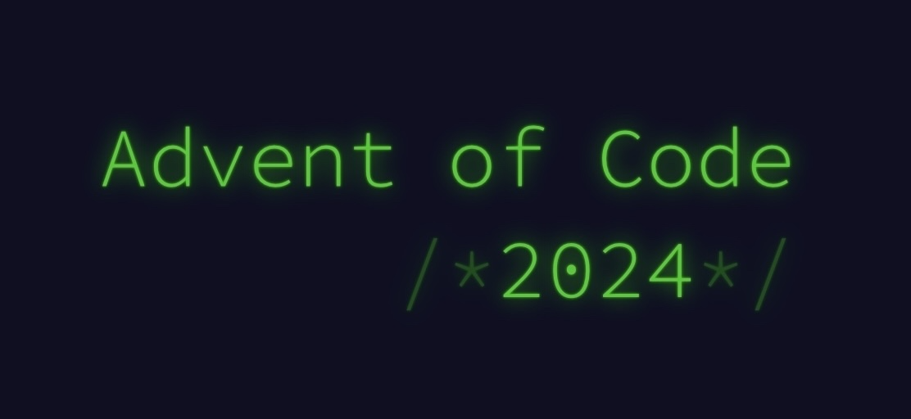

# 🎄 Advent of Code 2024

[Advent of Code](https://adventofcode.com) is an annual set of Christmas-themed computer programming challenges that follow an Advent calendar.


## ⚙️ Prerequisite

Check that `python3` is installed

```bash
  python3 -V
```

## ▶️ Run Locally

Clone the project [adventOfCode2023](https://github.com/koddeur//advent-of-code)

```bash
  git clone https://github.com/koddeur/advent-of-code.git
```

Go to the project directory

```bash
  cd advent-of-code
  cd adventOfCode2024
```

Go to the day directory

```bash
  cd XXdec
```

Then, execute the python file with input text file as first argument
(make sure that you can execute `chmod +x ./XXdec_partY.py`)

```bash
  ./XXdec_partY.py inputs/XXdec_input.txt
```

If you want to run all days, execute the following line, from the project root

```bash
 ./run_all_days.sh
```


## 💬 Usage/Examples

```shell
cd adventOfCode2024
cd 01dec
./01dec_part1.py inputs/01dec_input.txt

Output :
# Day 1 - part 1
----------------
Result => 1223326
```


## 🔗 Links
[](https://koddeur.com/)
[](https://www.linkedin.com/in/mael-avennec-727013170/)
[](https://twitter.com/koddeur)


## 👨🏼‍🎨 Author

[@koddeur](https://www.github.com/koddeur)